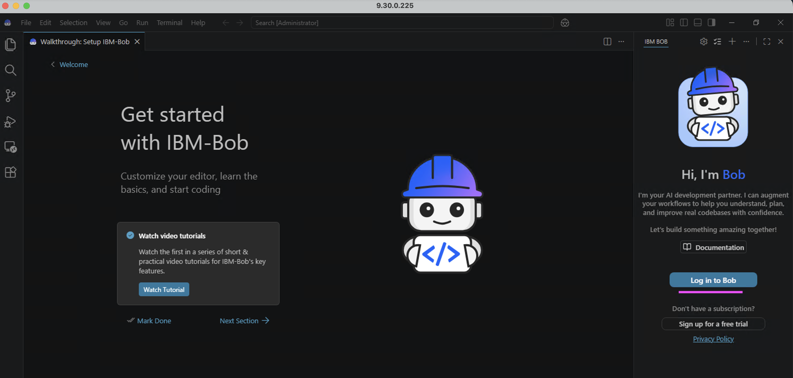
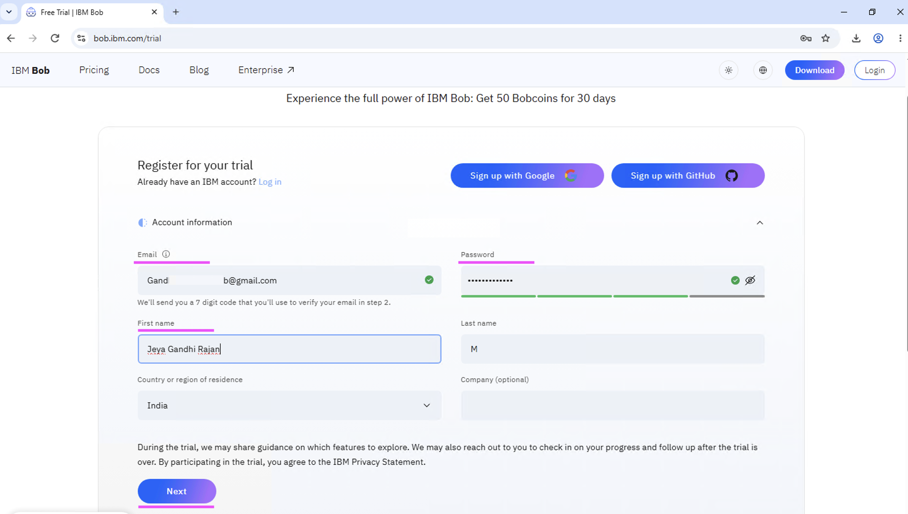
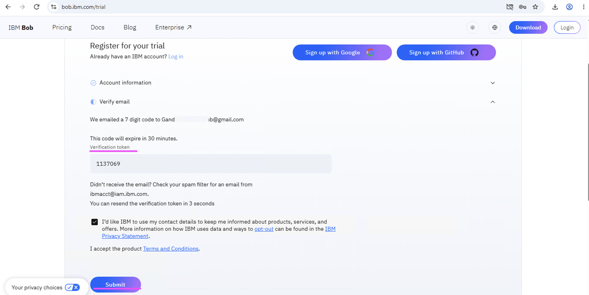
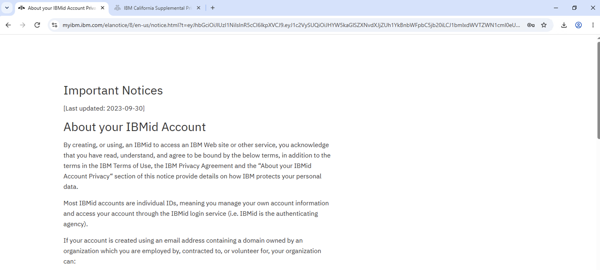
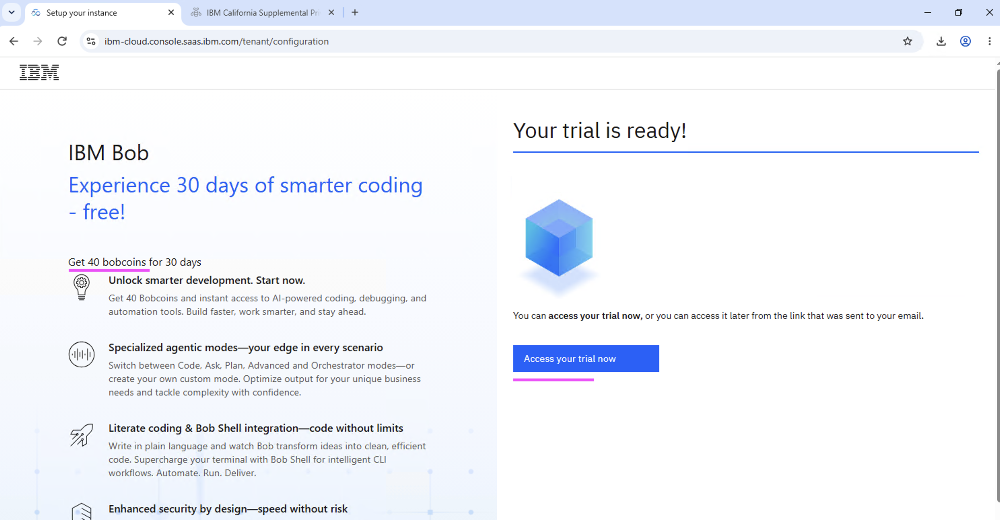
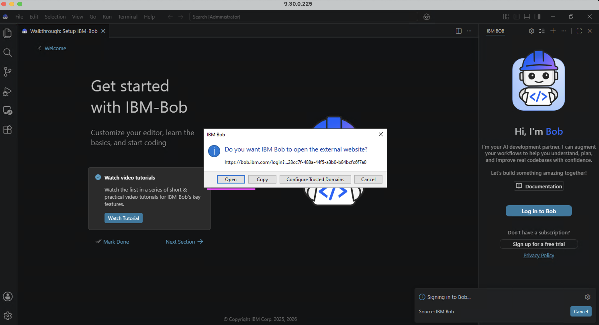
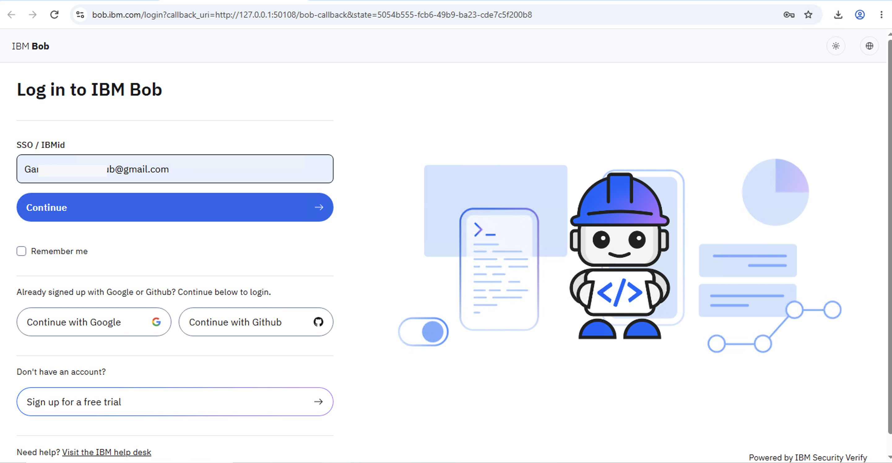
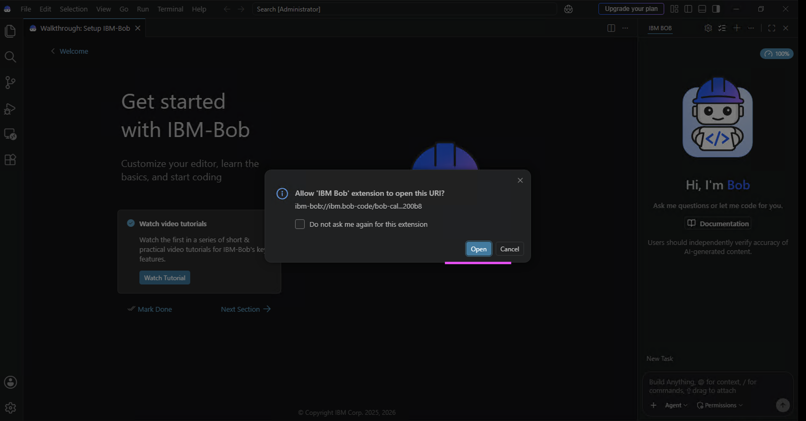
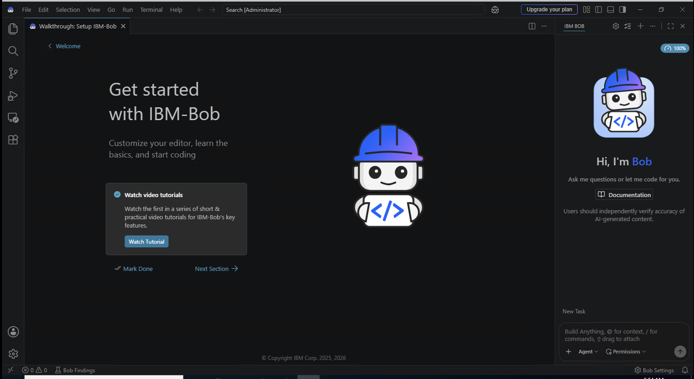

# IBM Bob Installation and Onboarding

## Overview

This document describes the prerequisites and setup steps required to start using the IBM Bob IDE. You will learn how to install the IDE, register for a free trial licence, and sign in using your trial account.

---

## 1. Install the IBM Bob IDE

1. Open the [IBM Bob IDE download page](https://bob.ibm.com/download?bob=ide).
2. Download and install the appropriate version of the IBM Bob IDE for your operating system.

---

## 2. Register for an IBM Bob Trial Licence

1. Open the [IBM Bob free trial registration page](https://bob.ibm.com/trial).
2. Enter your Name, Email address, Password and other information.
3. Click **Next**.

4. Enter the verification code sent to your email.
5. Click **Submit**.

6. Click **Proceed**.

Your IBM Bob trial licence is now ready to use.

---

## 3. Sign In to the IBM Bob IDE Using the Trial Licence

1. Open the IBM Bob IDE.
2. Click **Log in to Bob**.

3. Click **Open** to launch the login page in your web browser.

4. Enter your login information and click **Continue**.

5. Click **Open** to return to the IBM Bob IDE.

You are now signed in to the IBM Bob IDE and can begin using it.

---

## Conclusion

You have successfully installed the IBM Bob IDE, registered for a free trial licence, and signed in to the IDE. Your environment is now ready for IBM Bob hands-on labs and AI-assisted development activities.

## Reference

- Welcome to IBM Bob https://bob.ibm.com/docs/ide
- Installing https://bob.ibm.com/docs/ide/getting-started/install
- Download Bob https://bob.ibm.com/download?bob=ide
- Start Your Free Trial https://bob.ibm.com/trial